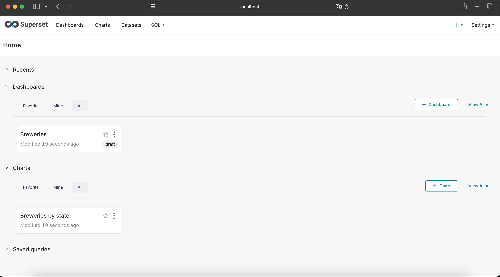

# breweries-case
Breweries Lake

## Table of Contents

- [About](#about)
- [Prerequisites](#prerequisites)
- [Getting Started](#getting_started)
- [Usage](#usage)

## About <a name = "about"></a>

This project is a lakehouse for the breweries data. It's a test that consists in ingesting data from an API following the medallion architecture to display an aggregated view with the number of breweries per type and location.

## Prerequisites <a name = "getting_started"></a>

- [docker-compose](https://docs.docker.com/compose/)

## Getting Started <a name = "getting_started"></a>

The project is using Apache-Airflow to orchestrate, Python and Pyspark in DAG's tasks, MinIO as storage simulating Amazon S3 Buckets, Apache-Drill as (SQL Query Engine) to read Delta tables (gold layer) and Apache Superset to data visualization.

Link to resources:
- [Apache-Airflow](https://airflow.apache.org)
- [Apache-Spark](https://spark.apache.org)
- [Apache-Superset](https://superset.apache.org/)
- [Apache-Drill](https://drill.apache.org/)
- [MinIO](https://min.io)

## Usage <a name = "usage"></a>

Before we begin, let's check the containers used in the project:

* **minio**: S3 Object Storage.
    * image: docker.io/bitnami/minio:2024
    * ports: 9000 in services and 9001 to Web UI
    * user: brew:brew4321
    * UI: http://localhost:9001


* **spark**: Large-scale, distributed processing system. The "spark" container is the "master".
    * image: docker.io/bitnami/spark:3.5.0
    * ports: 8080 to Web UI and 7077 in services
    * UI: http://localhost:8080


 
 * **spark-worker-#**: Spark workers.
    * image: docker.io/bitnami/spark:3.5.0

* **airflow**: ETL/ELT Orchestrator.
    * image: apache/airflow:2.10.2rc1-python3.10
    * ports: 8081 to Web UI
    * user: airflow:airflow
    * UI: http://localhost:8081


* **jupyter**: Jupyter gives a development environment. I've made some tests to the medal steps using notebooks in this environment.
    * image: jupyter/pyspark-notebook:2023-10-20
    * ports: 8888 to Web UI
    * UI: http://localhost:8888


* **drill**: Apache tool to access Delta Tables/Parquet Files using SQL Query Engine.
    * image: apache/drill:1.21.2
    * ports: 8047 to Web UI
    * UI: http://localhost:8047


* **superset**: Apache Superset is a tool to data visualization, generate reports and dashboards using data from Delta Tables.
    * image: apache/superset:994de1f-py310
    * ports: 8088 to Web UI
    * user: brew:brew4321
    * UI: http://localhost:8088



So to setup the environment, you can run these commands in a terminal (after going to the project folder):
```bash
docker compose build
```

```bash
docker compose up -d
```

To shutdown, use this command:
```bash
docker compose down
```